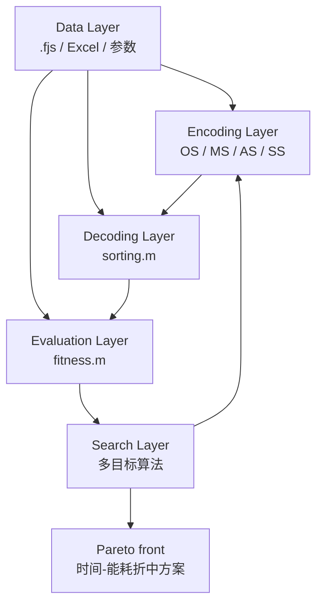

# FJSP-AGV 系统五层认知结构

## 核心问题

当前项目不是单一算法脚本，而是一个从实验数据到多目标搜索的调度优化系统。理解它最稳的方式，是把系统拆成五层：

1. Data Layer
2. Encoding Layer
3. Decoding Layer
4. Evaluation Layer
5. Search Layer

这五层回答的是同一个链条：**数据如何进入系统，如何变成决策，如何落成调度，如何被评价，如何被算法继续改进。**

## 五层结构

| 层 | 解决什么问题 | 核心模块/数据 | 输出给下一层什么 |
|---|---|---|---|
| Data Layer | 系统吃什么数据？ | `.fjs`、机器 Excel、AGV Excel、距离矩阵、能耗参数、实验参数 | `jobInfo`、`candidateMachine`、`distance_matrix`、`machineEnergy`、`AGVEnergy` |
| Encoding Layer | 用什么形式表达调度决策？ | `OS / MS / AS / SS` 染色体 | 一条可被解码的调度决策向量 |
| Decoding Layer | 决策如何变成真实调度过程？ | `sorting.m`、`machineTable`、`AGVTable`、`agvEGRecord` | 机器时间轴、AGV 时间轴、电量变化、卸载完成时间 |
| Evaluation Layer | 如何判断方案好不好？ | `fitness.m`、makespan、machine energy、AGV energy | 目标值 `[makespan, total energy]` |
| Search Layer | 如何找到更好的方案？ | NSGA-II、INSGA-II、MOEA/D、MOSSA、MOPSO | 新一代染色体、Pareto 解集 |

## 系统关系图



## 层与层如何连接

### Data -> Encoding

`.fjs` 提供工件、工序、候选机器和加工时间。编码层据此知道染色体长度、每个 `MS` 位置的合法机器范围，以及每个工件应该出现多少次。

### Encoding -> Decoding

染色体只表达决策，不直接等于甘特图。`sorting.m` 把 `OS / MS / AS / SS` 解释成工序顺序、机器选择、AGV 分配和速度选择。

### Decoding -> Evaluation

`sorting.m` 输出真实时间轴。`fitness.m` 不凭空算目标值，而是基于 `machineTable`、`AGVTable`、`jobCompleteUnLoad`、`agvEGRecord` 计算完工时间和能耗。

### Evaluation -> Search

算法只关心一个染色体的目标值是否更好。`fitness.m` 把复杂调度过程压缩成 `[makespan, total energy]`，供非支配排序、Pareto 选择和迭代更新使用。

## 怎么区分编码、解码、评价和搜索

这四层最容易混在一起。可以先用一句话区分：

```text
编码层 = 决策怎么表示。
解码层 = 决策怎么变成真实调度。
评价层 = 调度结果怎么打分。
搜索层 = 怎么不断生成更好的决策。
```

### 编码层：决策怎么表示

编码层回答：

```text
我要优化的调度方案，用什么形式交给算法搜索？
```

当前项目里，现实调度问题需要决定：

```text
哪个工件先做？
每道工序在哪台机器上做？
哪辆 AGV 去搬？
运输时用哪个速度？
```

这些决策被压成一条染色体：

```text
chrom = [OS, MS, AS, SS]
```

其中：

| 编码段 | 决策含义 |
|---|---|
| `OS` | 工序顺序决策 |
| `MS` | 机器选择决策 |
| `AS` | AGV 选择决策 |
| `SS` | 速度选择决策 |

编码层关心的是：

```text
chrom 长什么样？
每段代表什么？
每段长度多少？
每段取值范围是什么？
随机生成和交叉变异后怎么保持基本合法？
```

编码层不负责排时间轴，也不负责计算目标值。

### 解码层：决策怎么落地运行

解码层回答：

```text
这条染色体代表的决策，如何变成一个真实可执行的调度过程？
```

当前项目里，解码层核心是：

```text
sorting.m
```

它读取 `OS / MS / AS / SS`，然后安排真实加工和运输过程。它要处理的不是“编码是否合法”这么简单，而是现实调度约束，例如：

```text
同一个工件的前一道工序完成后，后一道才能开始
机器同一时间只能加工一个工序
AGV 同一时间只能做一个运输任务
AGV 要先空载去取工件，再负载送到目标机器
工件加工完之后才能进入下一段运输
电量不够时可能要充电
可以插入机器空闲时间段
```

所以解码层是：

```text
染色体 chrom -> 真实调度时间轴
```

典型输出包括：

```text
machineTable
AGVTable
jobCompleteUnLoad
agvEGRecord
```

### 评价层：调度结果怎么打分

评价层回答：

```text
这个调度方案好不好？
```

当前项目里，评价层核心是：

```text
fitness.m
```

它依赖解码层结果，计算：

```text
makespan
machine energy
AGV energy
total energy
```

所以评价层是：

```text
真实调度过程 -> 目标值 [makespan, totalEnergy]
```

它不负责生成染色体，也不负责搜索新方案。

### 搜索层：怎么找更好的方案

搜索层回答：

```text
怎么不断找到更好的染色体？
```

当前项目里，搜索层核心是：

```text
NSGA2.m
```

搜索层做的事情包括：

```text
生成初始种群
评价每条染色体
非支配排序
选择父代
交叉
变异
生成子代
合并种群
保留更好的个体
继续迭代
```

搜索层并不真正懂工厂怎么运行。它只关心：

```text
这条 chrom 的目标值是多少？
哪条 chrom 比较好？
下一代 chrom 怎么产生？
```

所以搜索层是：

```text
很多 chrom -> 评价 -> 筛选 -> 产生新 chrom
```

### 和数学规划模型的区别

这个项目不是单纯形法那种：

```text
建立线性规划模型
定义变量 x
写目标函数
写约束 Ax <= b
调用 simplex 求解
```

它更像是：

```text
设计染色体表达调度决策
用解码器把染色体翻译成可行调度
用目标函数评价好坏
用智能优化算法搜索更好的染色体
```

很多现实约束不是在编码里写死，而是在 `sorting.m` 解码时处理。

## 为什么这种分层重要

- 它把“数据是什么”和“算法怎么搜”分开，便于论文描述实验输入。
- 它把“染色体表达决策”和“真实调度如何发生”分开，便于解释编码/解码设计。
- 它把“调度运行过程”和“方案好坏评价”分开，便于复现 makespan 与能耗计算。
- 它让复杂科研代码不再是一团脚本，而是可解释、可测试、可复现的系统。

## 核心认知

- optimization 本质是在搜索更优调度决策。
- `sorting.m` 决定系统如何运行。
- `fitness.m` 决定系统如何评价好坏。
- Pareto front 本质是多个目标之间的 trade-off，而不是单一最优点。

## 2026-05-25 更新：解码层和评价层为什么联动

解码层和评价层是强联动的，但它们不是同一层。

一句话区分：

```text
解码层负责“排出来”。
评价层负责“算好不好”。
```

### 解码层干什么

解码层输入一条染色体：

```text
chrom = [OS, MS, AS, SS]
```

它把这条抽象决策翻译成真实调度过程：

```text
这一步调度哪个工件
这道工序选哪台机器
用哪辆 AGV 搬运
空载/负载用什么速度
什么时候运输
什么时候加工
机器时间表怎么排
AGV 时间表怎么排
电量什么时候变化
什么时候充电
```

当前解码层输出的是：

```text
machineTable
AGVTable
jobCompleteUnLoad
agvEGRecord
agvChargeNum
```

也就是 `schedule`，可以理解成“调度过程”。

### 评价层干什么

评价层拿解码层生成的 `schedule`，计算这个方案的目标值：

```text
makespan = 最后完工时间
totalEnergy = 机器能耗 + AGV 能耗
```

所以评价层输出的是：

```text
[makespan, totalEnergy]
```

### 为什么它们要一起看

因为评价层必须先有解码结果，才能算目标值：

```text
chrom
-> 解码层：变成 schedule
-> 评价层：根据 schedule 算 makespan / energy
```

在原始代码中，`fitness.m` 把这两件事混在一起：

```text
fitness.m
-> 初始化 machineTable / AGVTable
-> 调用 sorting.m 解码
-> 根据解码结果算 makespan / energy
```

我们现在已经完成的是：

```text
解码层：chrom -> schedule
```

下一步评价层要拆的是：

```text
schedule -> makespan / energy
```

因此，解码层自己负责的第一轮已经完成；剩下要继续推进的部分主要是评价层，以及解码层和评价层的接口联动。
