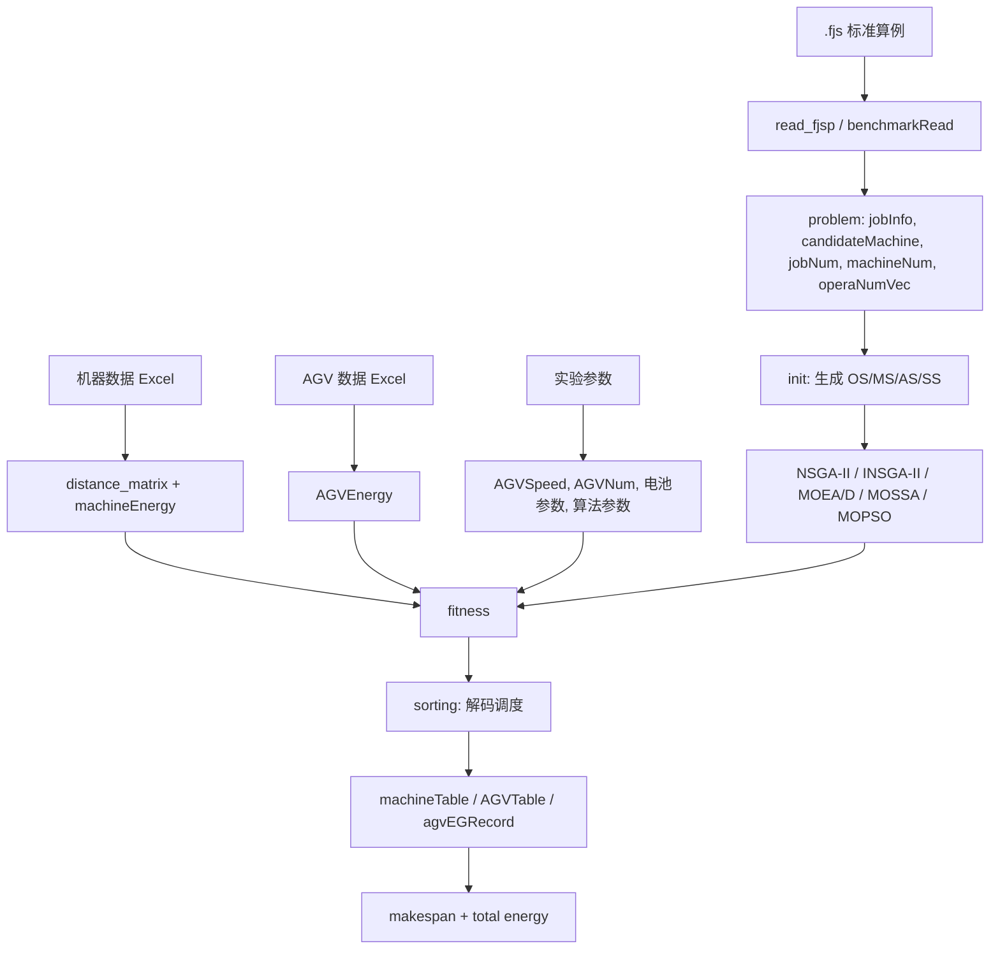

# 数据层认知地图

## 核心问题

当前系统的数据层回答一个问题：**一个标准 FJSP 算例如何被扩展成“机器加工 + AGV 搬运 + 能耗约束”的集成调度问题实例。**

算法本身不直接理解 Excel 或 `.fjs` 文件。它真正依赖的是被整理后的结构化数据：

- `jobInfo`：每道工序在各机器上的加工时间。
- `candidateMachine`：每道工序可选机器集合。
- `distance_matrix`：装载站、卸载站、机器之间的运输距离。
- `machineEnergy`：机器加工与空载能耗。
- `AGVEnergy`：AGV 空载与负载运输能耗。
- `AGVSpeed`、`AGVNum`、`AGVEG_MAX`、`AGVEG_MIN`、`eChargeSpeed`：AGV 运行与充电参数。

## 数据来源与作用

| 数据 | 来源 | 代码读取位置 | 系统作用 | 当前风险 |
|---|---|---|---|---|
| `.fjs` 标准算例 | `raw_code/fjsp/`、`data_sample/Mk01.fjs` | 原 `benchmarkRead.m`；新 `src/data/read_fjsp.m` | 定义工件、机器、工序、候选机器、加工时间 | 主脚本路径硬编码；旧函数会保存 `data.mat` |
| 机器数据 Excel | `机器数据.xlsx` | `dif_main.m`、`same_main.m` | 机器距离、机器能耗、机器布局 | 文件名和 sheet 名硬编码 |
| AGV 数据 Excel | `AGV数据.xlsx` | `dif_main.m`、`same_main.m` | AGV 空载/负载能耗 | AGV 数量、速度挡位仍在脚本中硬编码 |
| 距离矩阵 | Excel sheet 或由坐标计算 | `distance_from_xy.m`、主脚本 | 计算运输时间 | `distance_from_xy.m` 会回写 Excel |
| 实验参数 | 主脚本与算法内部 | 多处散落 | 控制算法与实验场景 | 参数分散，部分算法内部覆盖外部传参 |

## 数据流

## 真正的数据核心

`.fjs` 是标准调度算例核心，但当前研究问题不是普通 FJSP。机器 Excel、AGV Excel、距离矩阵和能耗参数共同把它扩展为：

> 带 AGV 搬运、速度选择、电量变化、充电行为和能耗目标的集成调度问题。

因此论文和复现中不能只记录 `.fjs` 算例名称，还必须记录机器布局、AGV 参数、距离矩阵、能耗参数和算法参数。

## sorting / fitness 对数据的依赖

`fitness.m` 是目标函数入口，`sorting.m` 是解码和调度仿真核心。

- `sorting.m` 依赖 `candidateMachine` 把 MS 编码翻译为实际机器。
- `sorting.m` 依赖 `distance_matrix` 和 `AGVSpeed` 计算运输时间。
- `sorting.m` 依赖 `AGVEnergy`、`AGVEG_MAX`、`AGVEG_MIN`、`eChargeSpeed` 维护电量和充电行为。
- `fitness.m` 依赖 `machineEnergy` 和 `agvEGRecord` 计算总能耗。

这说明：**编码只是表达决策，真正决定解是否可行、目标值是多少的是解码数据结构。**
