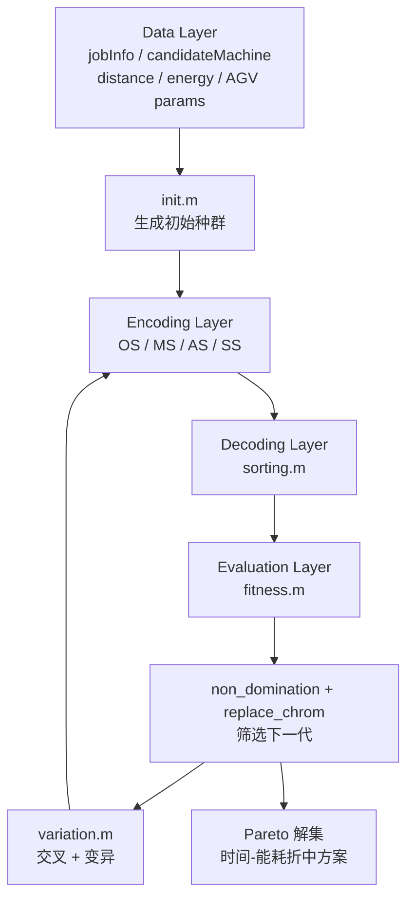
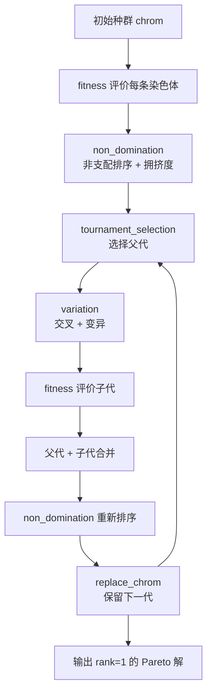

# Search Layer：基础搜索机制

## 核心问题

Search Layer 回答一个问题：**算法如何不断生成、评价、筛选调度方案。**

在当前 FJSP-AGV 系统中，算法并不直接操作真实工厂，也不直接移动机器或 AGV。算法操作的是染色体：

```text
chrom = [OS, MS, AS, SS]
```

一条染色体只有经过 `sorting.m` 解码，才会变成真实调度方案；再经过 `fitness.m` 评价，才会得到 `[makespan, total energy]`。

## 1. Search Layer 与前四层的关系



Search Layer 依赖前四层：

- Data Layer 提供合法决策范围和评价参数。
- Encoding Layer 定义染色体能表达哪些调度决策。
- Decoding Layer 把染色体变成机器/AGV 时间轴。
- Evaluation Layer 把调度结果变成目标值。
- Search Layer 根据目标值继续生成和筛选染色体。

## 2. init.m 如何生成初始染色体

`init.m` 生成初始种群，每一行是一条染色体。

### OS：工序顺序

`OS` 中每个工件编号出现的次数等于该工件的工序数。  
例如某工件有 3 道工序，它的编号就会在 `OS` 中出现 3 次。

初始化时先构造完整工件序列，再用混沌映射产生排序扰动，形成不同个体的工序顺序。

### MS：机器选择

`MS` 每个位置对应一道工序。它不是直接存机器编号，而是存“候选机器集合中的第几个选择”。

合法范围来自：

```text
candidateMachine{job, operation}
```

这保证每道工序只会选择它可加工的机器。

### AS：AGV 选择

`AS` 每个位置对应一道工序的搬运 AGV。  
合法范围是：

```text
1 ... AGVNum
```

### SS：速度选择

`SS` 长度是 `2 * operaNum`，因为每道工序涉及两个速度选择：

- 空载速度
- 负载速度

合法范围是：

```text
1 ... speedNum
```

初始化的本质：生成一批覆盖不同调度决策的初始候选解。

## 3. variation.m 如何产生新方案

`variation.m` 接收父代种群，输出子代染色体。它通过两类操作探索新方案。

### 交叉：组合两个已有方案

交叉的意义是把两个父代染色体中的部分决策重新组合。

- `OS` 使用工序顺序交叉，保留工件出现次数不变。
- `MS / AS / SS` 合并为资源选择段，进行多点交换。

这相当于在已有较好方案之间重新组合：

```text
一个方案的工序顺序 + 另一个方案的机器/AGV/速度选择
```

### 变异：制造局部扰动

变异用于跳出已有组合：

- `OS` 中交换两个不同工件位置，改变工序进入系统的顺序。
- `MS / AS / SS` 随机改动若干资源选择位置，改变机器、AGV 或速度。

变异不是随便生成非法方案，而是用 `candidateMachine`、`AGVNum`、`AGVSpeed` 控制合法范围。

## 4. NSGA-II 的基础搜索闭环

当前 NSGA-II 主流程可以理解为：



每一代都在重复：

1. 选择当前较好的染色体。
2. 通过交叉和变异产生新染色体。
3. 用 `fitness.m` 评价新染色体。
4. 合并父代和子代。
5. 根据多目标表现筛选下一代。

## 5. 非支配排序和拥挤度的作用

当前目标是同时最小化：

```text
makespan
total energy
```

一个方案如果在两个目标上都不比另一个差，并且至少一个目标更好，就支配另一个方案。

非支配排序的作用：

- rank 1：当前没有被其他方案支配的方案。
- rank 2、rank 3：逐层次较弱的方案。

拥挤度的作用：

- 当同一 rank 中方案太多时，优先保留更分散的方案。
- 避免种群只集中在 Pareto front 的某一小段。

所以 NSGA-II 不只是保留“看起来最小”的目标值，也在维护 Pareto 解集的多样性。

## 6. Pareto 解集在本项目中的意义

Pareto 解集不是一个唯一答案，而是一组时间和能耗之间的折中方案：

- 有些方案更快，但能耗更高。
- 有些方案更节能，但完工时间更长。
- 有些方案在两者之间取得平衡。

在论文实验中，Pareto front 用来展示算法能找到怎样的时间-能耗权衡边界。

## 7. 核心认知

- 算法搜索的是染色体空间，不是直接搜索真实工厂。
- 染色体经过 `sorting.m` 才变成调度方案。
- 调度方案经过 `fitness.m` 才得到目标值。
- NSGA-II 根据目标值进行非支配排序、拥挤度计算和精英保留。
- 多目标优化不是找唯一最优解，而是找一组 Pareto 折中方案。
- 在当前系统里，“好方案”的定义由 Evaluation Layer 给出，Search Layer 只是围绕这个定义持续探索。
