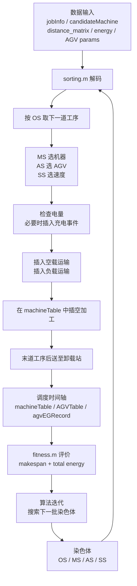

# 调度解码层：sorting.m 的系统作用

## 1. 为什么先看 sorting.m

在当前 FJSP-AGV 项目中，算法搜索的不是一张已经排好的甘特图，而是一条染色体。

`sorting.m` 的作用，是把这条染色体解释成真实调度过程：哪道工序先进入系统、在哪台机器加工、由哪辆 AGV 搬运、用什么速度、什么时候开始、什么时候结束、是否需要充电。  

因此它不是普通“排序函数”，而是连接数据、编码、调度仿真、目标评价和算法搜索的核心解码层。

## 2. 项目的五层结构

| 层 | 核心问题 | 关键内容 |
|---|---|---|
| 数据层 | 系统吃什么数据？ | `.fjs`、机器数据、AGV 数据、距离矩阵、能耗参数 |
| 编码层 | 染色体表达什么决策？ | `OS / MS / AS / SS` |
| 解码层 | 染色体如何变成调度方案？ | `sorting.m` 构造机器和 AGV 时间轴 |
| 评价层 | 方案好不好？ | `fitness.m` 计算 makespan 和总能耗 |
| 算法层 | 如何搜索更好的染色体？ | NSGA-II、INSGA-II、MOEA/D、MOSSA、MOPSO |

## 3. sorting.m 在五层中的位置

### 数据层：解码需要什么输入

`sorting.m` 不直接读文件，但强依赖已整理好的数据结构：

- `.fjs` 解析出的 `jobInfo`：每道工序在各机器上的加工时间。
- `.fjs` 解析出的 `candidateMachine`：每道工序的可选机器集合。
- `operaVec`：每个工件的工序数，用于判断当前工件执行到第几道工序。
- `distance_matrix`：装载站、卸载站、机器之间的运输距离。
- `AGVSpeed`：AGV 不同速度挡位。
- `AGVEnergy`：不同速度下空载/负载能耗。
- `AGVEG_MAX`、`AGVEG_MIN`、`eChargeSpeed`：电池容量、充电阈值和充电速度。

这些数据共同决定：一条染色体能不能变成合理调度，以及它的时间和能耗是多少。

### 编码层：染色体表达什么

染色体被切成四段：

| 编码段 | 含义 | 决策 |
|---|---|---|
| `OS` | Operation Sequence | 工序进入调度系统的顺序 |
| `MS` | Machine Selection | 每道工序选择候选机器中的哪一台 |
| `AS` | AGV Selection | 每道工序由哪辆 AGV 搬运 |
| `SS` | Speed Selection | 空载和负载运输分别使用哪个速度挡位 |

算法改变的是这些编码。`sorting.m` 负责解释这些编码。

### 解码层：如何变成真实调度

`sorting.m` 按 `OS` 从左到右处理工序。每遇到一个工件编号，就根据该工件已出现次数判断它当前是第几道工序。

每道工序的解码逻辑是：

1. 用 `MS` 在 `candidateMachine{job, operation}` 中选出实际机器。
2. 用 `AS` 选出执行搬运的 AGV。
3. 用 `SS` 选出空载速度和负载速度。
4. 检查 AGV 电量，低于阈值时安排前往卸载站充电。
5. 安排 AGV 空载移动到工件当前位置。
6. 安排 AGV 负载移动到目标机器。
7. 在目标机器时间轴中寻找可插入的空闲时间段。
8. 插入加工时间块，更新工件完成时间和所在位置。
9. 如果是该工件最后一道工序，再安排 AGV 将其送到卸载站。

`machineTable` 维护机器时间轴，记录加工和空闲片段。  
`AGVTable` 维护 AGV 时间轴，记录空载、负载、充电和前往充电的事件。  
`agvEGRecord` 记录 AGV 电量变化，是后续 AGV 能耗计算的依据。

“插空调度”是关键：工序不是简单排在机器末尾，而是在机器空闲块中寻找满足时间约束的位置。这个机制会直接改变 makespan 和机器空闲能耗。

## 4. 解码流程图

## 5. 评价层：fitness 为什么依赖 sorting

`fitness.m` 本身不直接“猜”目标值。它先初始化机器和 AGV 时间轴，然后调用 `sorting.m` 得到完整调度结果。

`sorting.m` 的输出决定：

- `jobCompleteUnLoad`：每个工件最终送到卸载站的时间，决定 `makespan`。
- `machineTable`：机器加工时间和空闲时间，决定机器加工能耗和空载能耗。
- `agvEGRecord`：AGV 电量下降记录，决定 AGV 能耗。
- `AGVTable`：用于展示和验证搬运、充电、卸载过程。

所以目标函数不是只由染色体数值直接计算，而是由“染色体解码后的调度过程”计算。

## 6. 算法层：为什么所有搜索都依赖 sorting

NSGA-II、INSGA-II、MOEA/D、MOSSA、MOPSO、VNS 和 Q-learning 都在做同一件事：产生或修改染色体。

但一条染色体是否优秀，只有经过 `sorting.m` 解码后才能知道：

- 工序顺序是否导致等待？
- 机器选择是否造成瓶颈？
- AGV 选择是否造成运输冲突？
- 速度选择是否带来更高能耗？
- 电量和充电是否拖慢完工？
- 插空后最终时间轴是否更紧凑？

因此算法不是直接优化工厂，而是在搜索一个由 `sorting.m` 解释的调度决策空间。

## 7. 核心认知结论

- `sorting.m` 本质是离散事件调度仿真器，不是普通排序函数。
- 编码层只表达决策，解码层决定这些决策如何落到真实时间轴上。
- `fitness.m` 依赖 `sorting.m` 的调度结果计算 makespan、机器能耗、AGV 能耗和总能耗。
- 算法搜索的是染色体，`sorting.m` 决定染色体对应的调度方案是否好。
- 对论文来说，`sorting.m` 对应“解码规则”和“调度仿真机制”；对复现来说，它是最需要稳定测试的核心模块之一。
