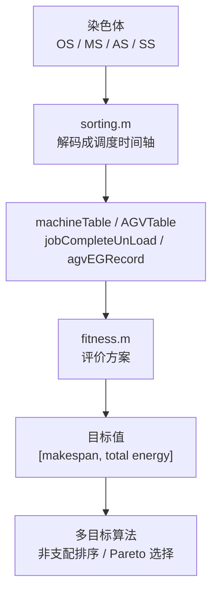

# Evaluation Layer：调度方案如何被评价

## 核心问题

评价层回答一个问题：**给定一条染色体对应的调度方案，它到底好不好？**

在当前系统中，“好方案”不是单一概念，而是两个目标共同决定：

- `makespan`：所有工件完成加工并送到卸载站的最晚时间，越小越好。
- `total energy`：机器能耗 + AGV 能耗，越小越好。

这两个目标共同形成 Pareto 优化问题。

## fitness.m 的位置



`fitness.m` 是算法和真实调度结果之间的评价接口。算法生成染色体，`fitness.m` 返回目标值，算法再根据目标值决定保留、淘汰或改进哪些染色体。

## 为什么 fitness 必须依赖 sorting

染色体本身只是编码，不能直接说明：

- 某台机器何时忙、何时空闲。
- 某辆 AGV 何时空载、何时负载、何时充电。
- 工件是否已经完成前序工序。
- 最终卸载是否完成。
- 电量是否因为运输下降。

这些必须由 `sorting.m` 解码后才能得到。因此 `fitness.m` 的目标值不是从染色体数字直接算出来的，而是从调度仿真结果中提取出来的。

## makespan 如何计算

`sorting.m` 会记录每个工件最终被送到卸载站的时间：

```text
jobCompleteUnLoad(job)
```

评价层取其中最大值：

```text
makespan = max(jobCompleteUnLoad)
```

这意味着当前模型中的完工，不只是“最后一道工序加工完成”，还包括“工件被 AGV 运到卸载站”。

## machine energy 如何计算

`machineTable` 记录每台机器的时间轴。每个时间片要么是：

- 加工某个工件：产生加工能耗。
- 空闲等待：产生空载/待机能耗。

评价层统计：

```text
machine work time
machine idle time
```

再乘以机器能耗参数：

```text
machine energy = workEnergy * workTime + idleEnergy * idleTime
```

因此插空调度不仅影响完工时间，也影响机器空闲时间和 idle energy。

## AGV energy 如何计算

`sorting.m` 在每次 AGV 空载运输、负载运输、前往充电等事件后更新电量，形成：

```text
agvEGRecord
```

评价层统计电量下降量，作为 AGV 能耗：

```text
AGV energy = sum(positive battery drops)
```

充电会使电量上升，代码中不会把上升量当作运输消耗。AGV 能耗主要来自运输过程中的电量下降。

## AGV 速度为什么影响能耗

速度通过 `SS` 编码进入解码：

- 空载速度影响空载运输时间和单位时间能耗。
- 负载速度影响负载运输时间和单位时间能耗。

更快的速度可能缩短运输等待，从而降低 makespan；但它也可能对应更高单位时间能耗，增加 transferEnergy。  
因此速度选择直接把“时间目标”和“能耗目标”耦合起来。

## 时间与能耗的 trade-off

当前系统天然存在目标冲突：

- 更快运输可能减少等待和完工时间，但增加 AGV 能耗。
- 更节能的速度可能降低能耗，但延长运输和机器等待。
- 机器选择加工快的设备可能降低 makespan，但该机器能耗可能更高。
- 插空调度可能压缩时间轴，但会改变机器空闲结构。
- 充电策略会影响 AGV 可用时间，也影响最终卸载时间。

所以不存在一个简单的“唯一最好方案”。多目标优化要找到一组折中解。

## Pareto 优化本质

Pareto front 表示一组非支配方案：

- 想进一步降低 makespan，可能要付出更高 energy。
- 想进一步降低 energy，可能要接受更长 makespan。

因此 Pareto 优化不是在找单个答案，而是在描述时间与能耗之间的可选边界。

## 核心认知

- `sorting.m` 决定系统如何运行，`fitness.m` 决定系统如何评价。
- `fitness.m` 把复杂调度过程压缩成算法可比较的目标值。
- makespan 衡量时间效率，total energy 衡量能耗效率。
- machine energy 包含加工能耗和 idleEnergy。
- AGV energy 来自运输导致的电量下降，速度选择会改变 transferEnergy。
- optimization 本质是在定义并搜索“什么叫更好的调度方案”。
