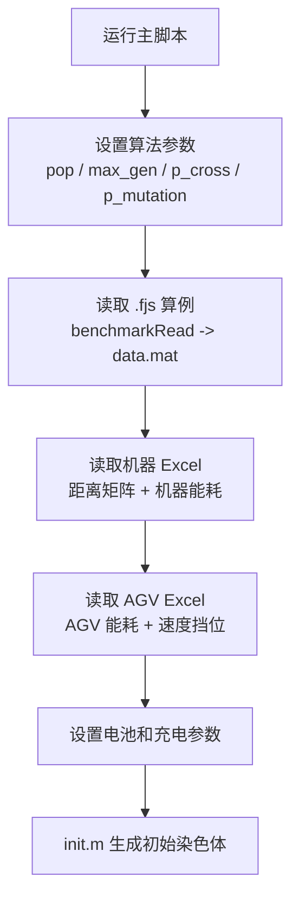
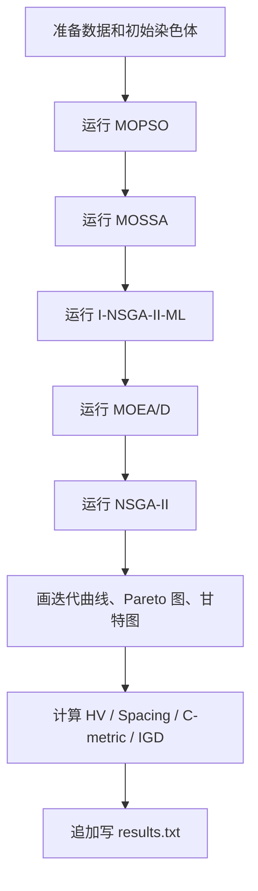
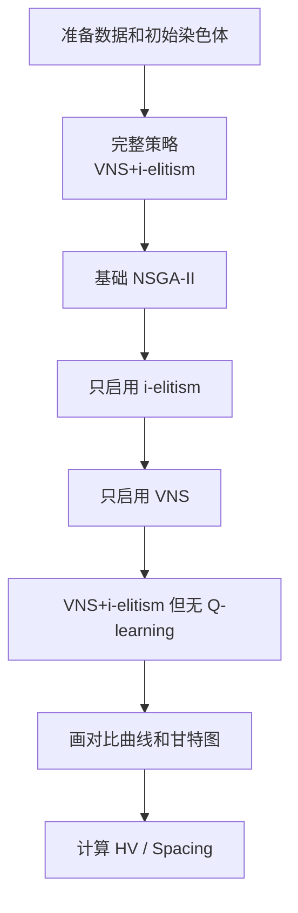

# 实验流程：dif_main.m 和 same_main.m 在跑什么

## 1. 先记住一句话

当前项目里有两个主要实验入口：

```text
dif_main.m  = 不同算法之间的横向对比
same_main.m = 同一算法不同改进策略的消融对比
```

也就是说：

- `dif_main.m` 关心“本文算法和其他算法比怎么样”。
- `same_main.m` 关心“本文算法里的每个改进模块有没有用”。

## 2. 两个脚本的共同开头

两个脚本前半段很像，都是先准备同一套实验输入。



共同输入包括：

- `.fjs` 算例：默认 `fjsp\Brandimarte_Data\Mk02.fjs`
- 机器数据：`机器数据.xlsx`
- AGV 数据：`AGV数据.xlsx`
- AGV 数量：`AGVNum = 3`
- AGV 速度：`[0.5, 0.75, 1.0]`
- 电池容量：`AGVEG_MAX = 100`
- 充电速度：`eChargeSpeed = 20`

共同风险：

- `benchmarkRead` 会生成 `data.mat`。
- `distance_from_xy` 会写回机器 Excel。
- 路径依赖当前目录。
- 没有固定随机种子。

## 3. dif_main.m：不同算法对比实验

`dif_main.m` 的作用是比较多个算法在同一问题上的表现。

它调用的算法包括：

| 算法结果变量 | 算法 | 代码目录 | 含义 |
|---|---|---|---|
| `INSGA_II_0_Result` | I-NSGA-II-ML | `INSGA-II/` | 本文改进算法 |
| `NSGA_II_Result` | NSGA-II | `NSGA-II/` | 基础对比算法 |
| `MOEAD_Result` | MOEA/D | `MOEAD/` | 分解型多目标算法 |
| `MOSSA_Result` | MOSSA | `MOSSA/` | 多目标麻雀搜索算法 |
| `MOPSO_Result` | MOPSO | `MOPSO/` | 多目标粒子群算法 |

### dif_main 的实验逻辑



### dif_main 输出什么

| 输出 | 文件名规律 | 说明 |
|---|---|---|
| Makespan 迭代曲线 | `figures/Figure1_i.fig/png` | 各算法每代最小完工时间变化 |
| Energy 迭代曲线 | `figures/Figure2_i.fig/png` | 各算法每代最小能耗变化 |
| 甘特图 | `figures/Figure3_i.fig/png` | 本文算法某个解的机器/AGV 调度图 |
| Pareto 图 | `figures/Figure5_i.fig/png` | 各算法最终非支配解分布 |
| 指标文本 | `results.txt` | 追加记录目标矩阵和指标 |

### dif_main 计算哪些指标

| 指标 | 用来说明什么 |
|---|---|
| HV | 解集覆盖能力，越大通常越好 |
| Spacing | 解集分布均匀性，越小通常越均匀 |
| C-metric | 两个算法解集之间的支配覆盖关系 |
| IGD | 解集到近似参考前沿的距离，越小通常越好 |

## 4. same_main.m：消融实验

`same_main.m` 的作用是比较同一个改进算法中，不同策略组合的效果。

它不是主要比较不同算法，而是回答：

```text
本文算法里的反向学习、VNS、Q-learning 等模块到底有没有贡献？
```

它调用的主要策略包括：

| 结果变量 | strategy 参数 | 含义 |
|---|---|---|
| `INSGA_II_0_Result` | `VNS+i-elitism` | 完整改进算法 |
| `NSGA_II_Result` | 无 strategy | 基础 NSGA-II |
| `INSGA_II_1_Result` | `i-elitism` | 只启用反向学习/改进精英 |
| `INSGA_II_2_Result` | `VNS` | 只启用 VNS |
| `INSGA_II_3_Result` | `NOQ_VNS+i-elitism` | 反向学习 + VNS，但不使用 Q-learning |

### same_main 的实验逻辑



### same_main 输出什么

| 输出 | 说明 |
|---|---|
| 迭代曲线 | 比较基础算法和部分改进策略的收敛趋势 |
| HV | 比较完整策略与无 Q-learning 策略的覆盖表现 |
| Spacing | 比较解集分布均匀性 |
| 甘特图 | 展示完整改进算法某个解的调度结果 |
| `figures/Figure3_i.fig/png` | 保存甘特图 |

注意：`same_main.m` 当前没有像 `dif_main.m` 那样系统写入 `results.txt`。

## 5. 两类实验的区别

| 问题 | dif_main.m | same_main.m |
|---|---|---|
| 研究目的 | 算法横向对比 | 改进策略消融 |
| 比较对象 | 不同算法 | 同一算法的不同策略组合 |
| 主要算法 | I-NSGA-II、NSGA-II、MOEA/D、MOSSA、MOPSO | 完整改进算法、基础 NSGA-II、去掉某些模块的版本 |
| 主要图 | 迭代曲线、Pareto 图、甘特图 | 策略对比曲线、甘特图 |
| 主要指标 | HV、Spacing、C-metric、IGD | HV、Spacing |
| 输出风险 | 追加写 `results.txt`，图可能覆盖 | 图可能覆盖 |

## 6. 为什么实验层很重要

前面的数据、编码、解码、评价和搜索，回答的是：

```text
一个方案怎么产生、怎么调度、怎么评价。
```

实验层回答的是：

```text
怎样证明一个算法或改进策略更好。
```

所以实验层把代码结果转化成论文里的证据：

- 迭代曲线说明收敛过程。
- Pareto 图说明最终解集分布。
- 甘特图说明调度方案是否可解释。
- HV、Spacing、C-metric、IGD 说明算法性能。
- 消融实验说明改进模块是否有效。

## 7. 复现时最需要注意的点

| 风险 | 出现位置 | 为什么影响复现 |
|---|---|---|
| 未固定随机种子 | `init`、各算法、交叉变异 | 每次运行结果不同 |
| 自动生成 `data.mat` | `benchmarkRead` | 可能不知道当前加载的是哪次数据 |
| 回写 Excel | `distance_from_xy` | 原始机器数据可能被改变 |
| 频繁 `cd` | 调用各算法、指标目录 | 换启动目录后容易找不到文件 |
| 输出覆盖 | `figures/Figure*_i` | 同名图会覆盖旧实验 |
| 结果追加 | `results.txt` | 多次运行结果会混在一起 |
| 参数散落 | 主脚本和算法内部 | 论文参数表和真实运行可能不一致 |

## 8. 当前模块状态

模块 7：实验流程，第一版完成。

还没有做的事：

- 没有重构实验脚本。
- 没有改变输出路径。
- 没有运行完整实验。
- 没有整理每个指标函数的内部计算细节。

下一步建议进入模块 8：

```text
复现与封装路线：后期怎么分块、处理数据、封装才不容易报错。
```

