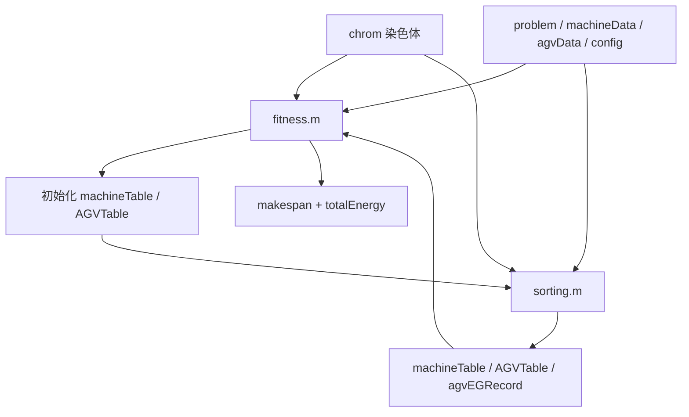

# 第 2 步：拆解 fitness/sorting 最小调用链

## 1. 这一步为什么先做

上一阶段已经完成了数据读取的第一版封装：

```text
.fjs -> problem
机器 Excel -> machineData
AGV Excel -> agvData
```

但现在还没有回答一个关键问题：

```text
这些读进来的数据，怎样才能真正进入算法评价？
```

所以这一步先不急着写测试，也不急着封装新函数，而是拆解：

```text
一条 chrom 要被 fitness/sorting 评价，最少需要哪些输入？
```

这一步的作用是给后面的封装定边界。

## 2. 这一步在复现时干什么

这一步不是为了马上得到论文结果，也不是为了证明算法效果。

它在复现时的作用是：

```text
确认“一个调度方案如何被评价”这条路到底通不通。
```

也就是说，它回答：

```text
我已经把数据读进来了，
那这些数据怎么进入 fitness.m？
fitness.m 又怎么调用 sorting.m？
最后 makespan 和 energy 是从哪里算出来的？
```

以后真正复现时，这一步会用来做三件事。

### 第一件事：当接口核对表

完整实验报错时，最常见的问题不是算法思想错，而是某个输入没准备对。

这一步把 `fitness.m` 需要的输入列清楚：

```text
chrom
problem 里的工件/工序/机器数据
machineData 里的距离和机器能耗
agvData 里的 AGV 速度和能耗
config 里的电量阈值和充电参数
```

以后如果调用 `fitness.m` 报错，就可以先按这个表检查：

```text
是不是少传了参数？
是不是变量名字对不上？
是不是维度不对？
是不是某个字段还没有从读取函数里拿出来？
```

### 第二件事：当排错地图

完整实验一旦跑不通，不能一上来就怀疑整个算法。

可以按这条链路排查：

```text
数据读取是否正常
-> chrom 是否存在
-> fitness 输入是否齐
-> sorting 是否能排出 machineTable / AGVTable
-> fitness 是否能从时间表算出 makespan / energy
```

这样错误会被定位到某一段，而不是变成一句模糊的：

```text
代码跑不起来。
```

### 第三件事：为后面封装评价函数做准备

后续要封装的不是 `fitness.m` 本身，而是一个旁路入口：

```text
evaluate_chromosome(chrom, problem, machineData, agvData, config)
```

这一步拆解就是在提前确定：

```text
这个新函数应该吃什么？
应该吐什么？
哪些数据来自读取函数？
哪些参数还没配置化？
哪些原始算法函数暂时不能动？
```

所以这一步在复现流程里的位置是：

```text
数据读取封装
-> fitness/sorting 调用链拆解
-> 单条染色体评价封装
-> 单条染色体评价测试
-> 小种群短迭代
-> 完整实验
```

一句话记：

```text
第 1 步解决“数据怎么读进来”。
第 2 步解决“读进来的数据怎么参与评价一个方案”。
```

## 3. 为什么没有直接跳去 init.m

从五层结构看，顺序是：

```text
数据层 -> 编码层 -> 解码层 -> 评价层 -> 搜索层
```

`init.m` 属于编码层，它负责生成染色体。

`fitness.m` 和 `sorting.m` 属于评价/解码链路，它们负责判断一条染色体好不好。

这一步先看 `fitness/sorting`，不是因为 `init.m` 不重要，而是因为：

```text
只有先知道评价函数需要什么样的 chrom 和数据，
后面才知道 init.m 生成的染色体必须满足什么格式。
```

所以当前路线不是换方向，而是先把最小评价入口摸清楚。

## 4. 最小调用链长什么样

在基础 NSGA-II 目录中，核心调用关系是：



一句话理解：

```text
fitness.m 是评价入口，
sorting.m 是真实排程过程，
fitness.m 先让 sorting 排出时间表，
再根据时间表计算完工时间和能耗。
```

## 5. fitness.m 需要哪些输入

`fitness.m` 的调用形式是：

```matlab
fitness(chrom, jobNum, jobInfo, operaVec, machineNum, AGVNum, AGVSpeed, candidateMachine, ...
    distance_matrix, machineEnergy, AGVEnergy, AGVEG_MAX, AGVEG_MIN, eChargeSpeed)
```

这些输入可以分成四类。

| 输入 | 来自哪里 | 作用 |
|---|---|---|
| `chrom` | 编码层生成 | 表示一个调度方案 |
| `jobNum` | `.fjs` | 工件数量 |
| `jobInfo` | `.fjs` | 每道工序在各机器上的加工时间 |
| `operaVec` | `.fjs` | 每个工件有几道工序 |
| `machineNum` | `.fjs` | 机器数量 |
| `candidateMachine` | `.fjs` | 每道工序可选哪些机器 |
| `AGVNum` | AGV 数据或配置 | AGV 数量 |
| `AGVSpeed` | AGV 数据或配置 | AGV 速度档位 |
| `distance_matrix` | 机器 Excel | 装载站、卸载站、机器之间的距离 |
| `machineEnergy` | 机器 Excel | 机器加工和空闲能耗 |
| `AGVEnergy` | AGV Excel | AGV 空载和负载能耗 |
| `AGVEG_MAX` | 实验参数 | AGV 最大电量 |
| `AGVEG_MIN` | 实验参数 | AGV 充电阈值 |
| `eChargeSpeed` | 实验参数 | AGV 充电速度 |

对应到当前已封装函数：

| 数据结构 | 已有来源 |
|---|---|
| `problem.jobNum` | `read_fjsp.m` |
| `problem.jobInfo` | `read_fjsp.m` |
| `problem.operaNumVec` | `read_fjsp.m` |
| `problem.machineNum` | `read_fjsp.m` |
| `problem.candidateMachine` | `read_fjsp.m` |
| `machineData.distance_matrix` | `read_machine_data.m` |
| `machineData.machineEnergy` | `read_machine_data.m` |
| `agvData.AGVNum` | `read_agv_data.m` |
| `agvData.AGVSpeed` | `read_agv_data.m` |
| `agvData.AGVEnergy` | `read_agv_data.m` |

还没有封装好的部分是：

```text
AGVEG_MAX
AGVEG_MIN
eChargeSpeed
以及算法参数 pop、max_gen、p_cross、p_mutation、seed 等
```

这些属于后续 `config`。

## 6. fitness.m 自己做了什么

`fitness.m` 不是直接凭空计算目标值。

它分三步：

### 第一步：初始化机器时间表

它先给每台机器建立一个空闲时间块：

```text
start = 0
end = Inf
job = 0
opera = 0
```

意思是：

```text
每台机器一开始从 0 到无穷大都是空闲的。
```

后面 `sorting.m` 会把加工任务插入这些空闲时间块里。

### 第二步：初始化 AGV 时间表

它也给每辆 AGV 建立一个空闲时间块，里面记录：

```text
start
end
job
opera
load_status
from_machine
to_machine
charge
```

意思是：

```text
每辆 AGV 一开始也是空闲的，后面会被插入空载、负载、充电等任务。
```

### 第三步：调用 sorting.m 解码

核心调用是：

```text
fitness.m -> sorting.m
```

`sorting.m` 会把 `chrom` 解释成真实调度时间表。

## 7. sorting.m 做了什么

`sorting.m` 是解码器。它不是普通排序函数，而是在模拟一个调度过程。

它先把染色体切成四段：

| 片段 | 含义 | 决定什么 |
|---|---|---|
| `OS` | 工序顺序 | 哪个工件的下一道工序先安排 |
| `MS` | 机器选择 | 当前工序选哪台候选机器 |
| `AS` | AGV 选择 | 当前运输任务用哪辆 AGV |
| `SS` | 速度选择 | AGV 空载/负载用哪个速度档位 |

然后它按 `OS` 顺序逐个安排工序。

每安排一道工序，大致做这些事：

1. 确认当前是哪个工件、该工件第几道工序。
2. 根据 `MS` 选择加工机器。
3. 根据 `AS` 选择 AGV。
4. 根据 `SS` 选择空载速度和负载速度。
5. 检查 AGV 电量，不够就安排去卸载站充电。
6. 安排 AGV 空载转移。
7. 安排 AGV 负载转移。
8. 在机器时间轴里找空闲时间块，插入加工任务。
9. 如果是该工件最后一道工序，安排 AGV 把工件送到卸载站。
10. 记录工件最终卸载完成时间。

所以 `sorting.m` 的输出不是一个简单数字，而是一整套排程结果。

## 8. sorting.m 输出什么

`sorting.m` 输出：

| 输出 | 含义 |
|---|---|
| `machineTable` | 每台机器的加工/空闲时间表 |
| `AGVTable` | 每辆 AGV 的空载、负载、充电时间表 |
| `jobCompleteUnLoad` | 每个工件被送到卸载站的完成时间 |
| `agvEGRecord` | 每辆 AGV 的电量变化记录 |
| `agvChargeNum` | 每辆 AGV 的充电次数 |

这些输出会被 `fitness.m` 继续使用。

## 9. fitness.m 怎么算目标值

`fitness.m` 主要算两个目标：

```text
makespan
totalEnergy
```

### makespan

```text
makespan = 所有工件最终卸载完成时间的最大值
```

也就是：

```text
最后一个完成并送到卸载站的工件，完成在什么时候。
```

### 机器能耗

机器能耗分两类：

```text
加工能耗
空闲能耗
```

`fitness.m` 会遍历 `machineTable`：

- 如果某段时间 `job = 0`，说明机器空闲，累计空闲时间。
- 如果某段时间 `job ~= 0`，说明机器加工，累计加工时间。

然后用：

```text
加工时间 * 加工能耗参数
空闲时间 * 空闲能耗参数
```

得到机器总能耗。

### AGV 能耗

AGV 能耗不是重新按路径算一遍，而是根据 `agvEGRecord` 的电量下降量统计。

核心理解是：

```text
电量减少了多少，就认为 AGV 消耗了多少能量。
```

充电导致电量上升的部分不会计入消耗。

### 总目标

最后：

```text
FUNC = {[makespan, 机器能耗 + AGV能耗]}
```

也就是说，一个调度方案最终被评价为两个数：

```text
时间目标：越小越好
能耗目标：越小越好
```

## 10. 这一步暴露出的封装边界

后面如果要封装“评价一条染色体”，理想入口不是继续传十几个散变量，而是：

```text
evaluate_chromosome(chrom, problem, machineData, agvData, config)
```

它内部再拆成原算法需要的变量：

```text
jobNum          <- problem.jobNum
jobInfo         <- problem.jobInfo
operaVec        <- problem.operaNumVec
machineNum      <- problem.machineNum
candidateMachine<- problem.candidateMachine
distance_matrix <- machineData.distance_matrix
machineEnergy   <- machineData.machineEnergy
AGVNum          <- agvData.AGVNum
AGVSpeed        <- agvData.AGVSpeed
AGVEnergy       <- agvData.AGVEnergy
AGVEG_MAX       <- config.AGVEG_MAX
AGVEG_MIN       <- config.AGVEG_MIN
eChargeSpeed    <- config.eChargeSpeed
```

这就是这一步拆解的价值：

```text
先知道该传什么，再封装。
```

## 11. 暂时不能乱改什么

当前阶段不应该直接改：

- `raw_code/NSGA-II/fitness.m`
- `raw_code/NSGA-II/sorting.m`
- `raw_code/NSGA-II/table_insert.m`
- `raw_code/NSGA-II/decompose_machineTable.m`
- `raw_code/NSGA-II/decompose_AGVTable.m`

原因是：

```text
这些函数共同决定一个染色体如何变成真实调度结果。
一旦改错，算法结果会整体变化。
```

正确做法是：

```text
先写旁路封装
再用小测试验证
最后才考虑替换主脚本调用
```

## 12. 这一步完成后，下一步是什么

现在完成的是：

```text
拆解 fitness/sorting 最小调用链
```

下一步才适合做封装设计。

推荐下一步是：

```text
封装 evaluate_chromosome.m 的输入输出边界
```

但在真正写代码前，需要先决定：

```text
config 里至少放哪些参数？
使用 NSGA-II 目录作为第一条最小链路，还是使用 INSGA-II？
是否只做旁路调用，不改 raw_code？
```

当前建议：

```text
先用 raw_code/NSGA-II 作为基础链路。
只新增 src/evaluation/evaluate_chromosome.m。
不修改 raw_code。
不替换主脚本。
```
