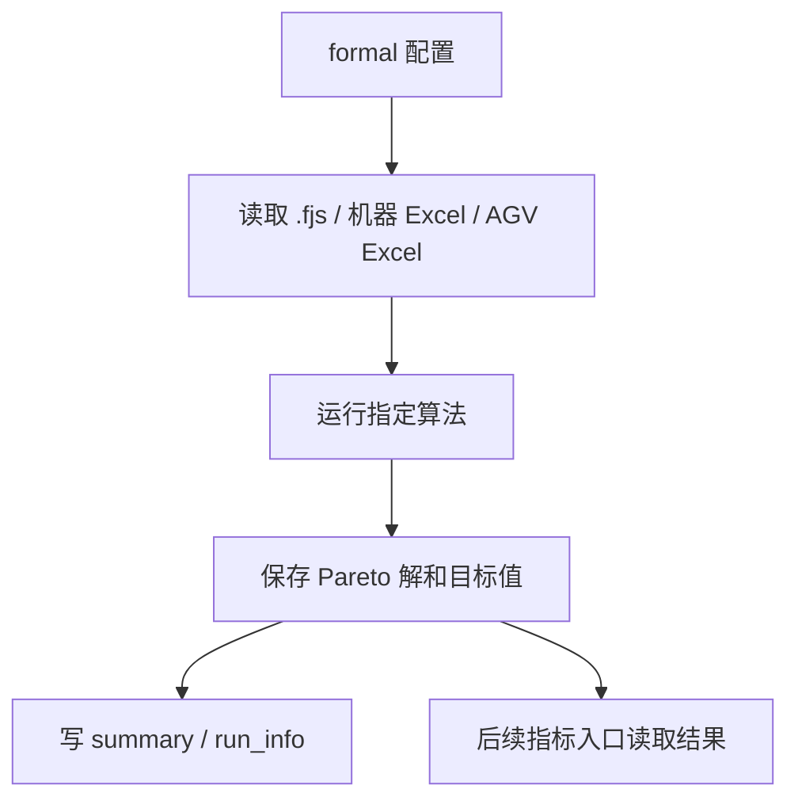

# 第 14 步：正式实验入口设计

## 1. 这一步解决什么问题

现在项目已经有三个能跑的入口：

```text
single：单条染色体评价
small：小种群 2 代，用来快速检查
medium：小幅放大 5 代，用来检查骨架能不能稍微放大
```

但它们都不是“正式复现实验入口”。

第 14 步要先把入口层次设计清楚，回答：

```text
以后真正复现时，我在 MATLAB 里输入什么？
这个入口用哪个配置？
它输出到哪里？
它后面怎么接指标计算？
small / medium / formal 到底分别干什么？
```

本步只更新文档，不新增代码，不运行 MATLAB。

## 2. 当前入口分层

| 层级 | 当前入口 | 作用 | 是否已实现 |
|---|---|---|---|
| 数据检查 | `tests/test_read_*.m` | 检查 `.fjs`、机器 Excel、AGV Excel 能否读取 | 已实现 |
| 配置检查 | `tests/test_small_nsga2_config.m` | 检查配置文件、路径、参数是否完整 | 已实现 |
| 单条评价 | `scripts/run_single_evaluation.m` | 检查 1 条染色体能否被 `fitness/sorting` 评价 | 已实现 |
| 快速搜索 | `scripts/run_small_nsga2.m` | 用小参数确认 NSGA-II 搜索闭环能跑 | 已实现 |
| 轻微放大 | `scripts/run_medium_nsga2.m` | 用稍大参数确认运行骨架能放大一点 | 已实现 |
| 正式实验 | `scripts/run_formal_nsga2.m` | 面向正式复现的 NSGA-II 主入口 | 已实现第一版 |
| 指标计算 | `scripts/run_metrics.m` | 读取正式实验结果，计算 HV、IGD、Spacing、C-metric 等 | 未实现 |

## 3. 不同入口分别什么时候用

| 你现在想做什么 | 应该跑什么 |
|---|---|
| 隔一段时间回来，确认项目没坏 | `test_small_nsga2_config` + `run_small_nsga2` |
| 换了数据，先看能不能读 | `test_read_fjsp`、`test_read_machine_data`、`test_read_agv_data` |
| 怀疑 `fitness/sorting` 调用有问题 | `run_single_evaluation` |
| 想快速检查搜索流程 | `run_small_nsga2` |
| 想轻微放大一点看看稳不稳 | `run_medium_nsga2` |
| 想跑 formal 第一版 | `run_formal_nsga2` |
| 想算论文指标 | 等指标入口实现后跑 `run_metrics` |

简单记：

```text
small 是体检。
medium 是轻微压力测试。
formal 才是未来正式复现。
metrics 是结果分析，不是搜索过程本身。
```

## 4. 未来正式实验入口应该做什么

未来正式入口不应该只是把 `pop` 和 `max_gen` 改大。

它应该稳定完成一条完整链路：



也就是说，正式入口至少要明确：

```text
跑哪个数据集
跑哪个算法
跑多少次
每次 seed 是多少
pop / max_gen 等参数是多少
结果保存到哪个 outputs 子目录
是否后续交给指标入口计算
```

## 5. 建议的未来文件关系

后续如果开始写正式入口，建议采用下面关系：

```text
configs/
├── small_nsga2_config.m      # 快速检查
├── medium_nsga2_config.m     # 轻微放大
└── formal_nsga2_config.m     # formal 复现配置

scripts/
├── run_single_evaluation.m   # 单条评价
├── run_small_nsga2.m         # small
├── run_medium_nsga2.m        # medium
├── run_formal_nsga2.m        # formal 搜索入口
└── run_metrics.m             # 未来指标计算入口
```

当前不要急着新增这些文件。  
先把入口职责分清，后面实现时才不会又把配置、搜索、指标、画图混在一个脚本里。

## 6. 正式入口和指标入口不要混在一起

正式实验入口负责：

```text
读数据
读配置
跑算法
保存 Pareto 解、目标矩阵、曲线、摘要
```

指标入口负责：

```text
读取已经保存的结果
计算 HV / IGD / Spacing / C-metric
保存指标表
```

为什么要分开？

因为搜索过程可能很慢，指标计算可以反复做。  
如果把它们绑死在一起，后面只想改指标或重画图，也可能被迫重新跑算法。

## 7. 输出目录建议

未来正式入口建议输出到：

```text
outputs/formal_nsga2/时间戳/
```

未来指标入口建议输出到同一次运行下面：

```text
outputs/formal_nsga2/时间戳/metrics/
```

这样一次正式运行的搜索结果、参数记录、指标结果都在同一个时间戳目录里。

当前已有输出目录仍然保持：

```text
outputs/single_evaluation/时间戳/
outputs/small_nsga2/时间戳/
outputs/medium_nsga2/时间戳/
```

## 8. 当前阶段不要做什么

第 14 步当时只是入口设计；现在 formal 第一版入口已经落地。后续仍然不要：

```text
不要新增 run_metrics.m
不要直接跑大参数
不要把指标计算塞进 small / medium 脚本
不要改 raw_code/
```

下一步如果继续工程化，才考虑实现正式入口的最小版本。

## 9. 本步完成标准

第 14 步完成后，你应该能区分：

```text
tests 是检查
single 是单条评价
small 是快速体检
medium 是轻微放大
formal 是未来正式复现
metrics 是未来结果分析
```

这一步的重点不是“马上跑大实验”，而是先防止入口混乱。
