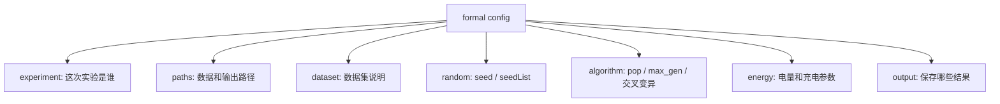

# 第 15 步：正式实验配置设计

## 1. 这一步解决什么问题

第 14 步已经把入口分清了：

```text
small / medium 是现在能跑的检查入口
formal 是未来正式复现入口
metrics 是未来指标入口
```

第 15 步继续往前走一点：先设计 `formal` 配置里应该有哪些字段。

本步只更新文档，不新增 `configs/formal_nsga2_config.m`，不运行 MATLAB。

## 2. 为什么先设计配置，不直接写代码

正式实验不是简单把：

```text
pop = 10
max_gen = 2
```

改成更大的数字。

正式配置还要说清楚：

```text
跑哪个数据
跑哪个算法
跑几次
每次 seed 是什么
结果放哪里
后面是否计算指标
```

如果这些字段没想清楚，直接新增脚本很容易又变成一个“大杂烩主脚本”。

## 3. 当前已有配置长什么样

当前已有两个配置：

```text
configs/small_nsga2_config.m
configs/medium_nsga2_config.m
```

它们已经包含：

| 配置块 | 当前字段 | 用途 |
|---|---|---|
| `paths` | `.fjs`、机器 Excel、AGV Excel、算法目录、输出目录 | 决定从哪里读、往哪里写 |
| `random` | `seed` | 控制随机过程 |
| `algorithm` | `pop`、`max_gen`、`p_cross`、`p_mutation` | 控制搜索规模和变异交叉 |
| `energy` | `AGVEG_MAX`、`eChargeSpeed` | 控制 AGV 电量与充电参数 |

`formal` 配置应该继承这个结构，但要比 small / medium 更完整。

## 4. formal 配置建议字段

未来 `formal` 配置建议按 7 块组织。

### 4.1 实验身份

用于说明这次正式实验是谁。

```text
config.experiment.name
config.experiment.description
config.experiment.runType
```

建议含义：

| 字段 | 含义 |
|---|---|
| `name` | 实验名称，例如 `formal_nsga2_Mk01` |
| `description` | 人能看懂的说明 |
| `runType` | `formal`，用于和 `small`、`medium` 区分 |

### 4.2 数据路径

用于说明输入数据从哪里来。

```text
config.paths.fjsp
config.paths.machineExcel
config.paths.agvExcel
config.paths.algorithmDir
config.paths.outputBaseDir
```

正式实验仍然要使用相对项目根目录拼路径，不能写死本机绝对路径。

### 4.3 数据集信息

用于说明这组数据代表什么。

```text
config.dataset.name
config.dataset.source
config.dataset.note
```

建议含义：

| 字段 | 含义 |
|---|---|
| `name` | 数据集名称，例如 `Mk01` |
| `source` | 数据来源，例如标准 FJSP 样例或论文样例 |
| `note` | 特殊说明，例如机器/AGV Excel 是否与该 `.fjs` 匹配 |

### 4.4 随机控制

正式实验不能只写一个 seed。后续如果要多次重复运行，应该能记录一组 seed。

```text
config.random.seedList
config.random.currentSeed
```

建议先从小规模做起：

```text
seedList = [42]
```

以后再扩展为：

```text
seedList = [1, 2, 3, 4, 5]
```

### 4.5 算法参数

控制搜索规模。

```text
config.algorithm.name
config.algorithm.pop
config.algorithm.max_gen
config.algorithm.p_cross
config.algorithm.p_mutation
```

建议含义：

| 字段 | 含义 |
|---|---|
| `name` | 当前先用 `NSGA-II` |
| `pop` | 种群规模 |
| `max_gen` | 最大迭代代数 |
| `p_cross` | 交叉概率 |
| `p_mutation` | 变异概率 |

不要一开始就设置很大。正式入口第一版可以先用比 medium 稍大的参数确认能跑，再逐步放大。

### 4.6 能耗参数

这些参数会影响总能耗目标，必须记录。

```text
config.energy.AGVEG_MAX
config.energy.eChargeSpeed
```

后续如果把更多能耗参数从 Excel 或代码里拆出来，也应该统一进入 `config.energy`。

### 4.7 输出与记录

用于控制结果保存。

```text
config.output.saveSummary
config.output.saveMat
config.output.saveRunInfo
config.output.saveLog
```

建议第一版：

```text
saveSummary = true
saveMat = true
saveRunInfo = true
saveLog = false
```

也就是说，先保证能保存摘要、MATLAB 结果和运行信息，详细日志后面再加。

## 5. 建议的 formal 配置结构图



## 6. formal 和 small / medium 的区别

| 配置 | 作用 | 参数大小 | 是否用于正式复现 |
|---|---|---|---|
| `small` | 快速检查项目是否还能跑 | 很小 | 否 |
| `medium` | 轻微放大，检查骨架稳定性 | 小到中等 | 否 |
| `formal` | 面向后续正式复现 | 可逐步放大 | 是 |

不要把 `small` 当论文实验，也不要把 `formal` 一开始就写成最大规模。

更稳的做法是：

```text
先让 formal 第一版能跑通
再逐步调大 pop / max_gen / seedList
最后才接指标计算
```

## 7. 下一步是否新增 formal 配置

本步完成后，可以有两个选择。

| 选择 | 做什么 | 适合什么时候 |
|---|---|---|
| A | 先不新增代码，只保留设计 | 你还想继续确认字段是否合理 |
| B | 新增 `configs/formal_nsga2_config.m` 的最小版本 | 你准备开始实现正式入口骨架 |

当前已经选择 B，并已新增：

```text
configs/formal_nsga2_config.m
```

它只定义配置，不运行算法。

当前仍然没有新增：

```text
scripts/run_formal_nsga2.m
```

也就是说，现在完成的是：

```text
formal 配置文件最小实现
```

下一步才考虑：

```text
formal 配置读取测试
或 scripts/run_formal_nsga2.m 的最小运行入口
```

## 8. 本步完成标准

第 15 步完成后，应该清楚：

```text
formal 配置不是只改大参数
formal 配置要记录实验身份、数据、seed、算法参数、能耗参数、输出规则
formal 第一版也应该从可控小规模开始
指标计算不应该混进 formal 配置本身
```

这一步仍然不改变算法，也不改变任何运行结果。
