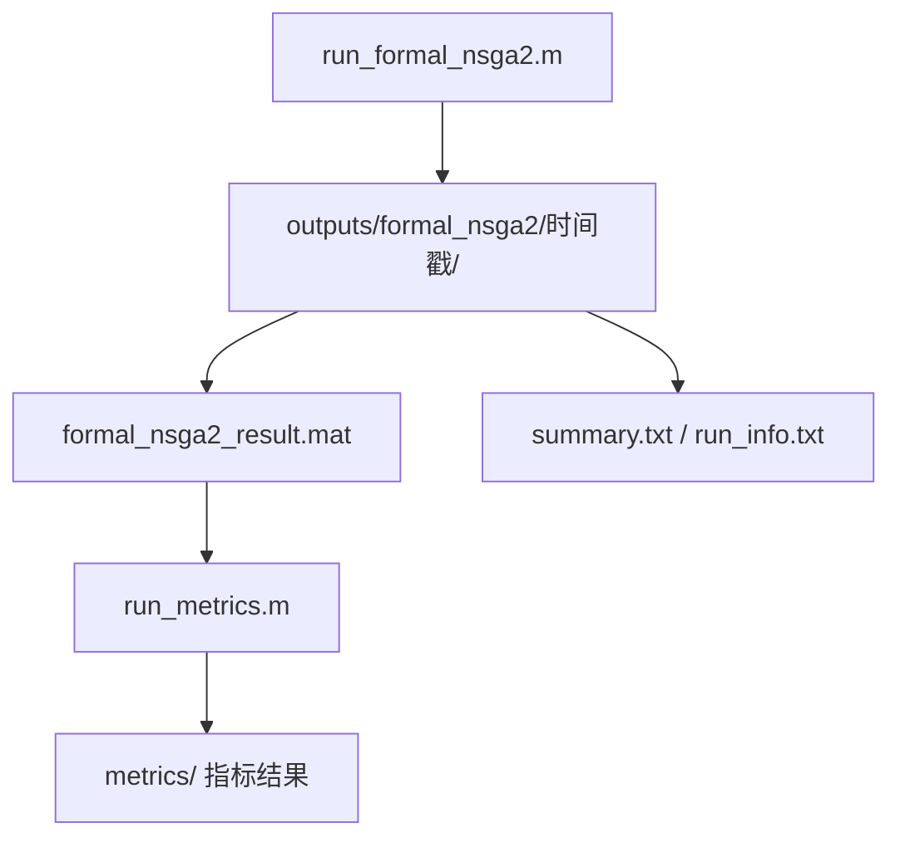

# 第 17 步：指标入口设计

## 1. 这一步解决什么问题

现在 `run_formal_nsga2.m` 已经能跑通，并把结果保存到：

```text
outputs/formal_nsga2/时间戳/
```

下一步不是继续把搜索脚本写大，而是实现指标入口的最小读取版：

```text
scripts/run_metrics.m
```

这个入口负责读取已经跑完的结果，先生成最小指标摘要。  
当前已经新增 `scripts/run_metrics.m`，但还没有运行 MATLAB。

## 2. run_formal_nsga2 和 run_metrics 的关系

这两个入口不要混在一起。



简单说：

```text
run_formal_nsga2.m 负责“跑算法，生成结果”。
run_metrics.m 负责“读结果，算指标”。
```

搜索和指标分开，是为了以后只改指标或重算指标时，不用重新跑算法。

## 3. run_metrics.m 当前读取什么

当前指标入口读取最新的：

```text
outputs/formal_nsga2/某个时间戳/formal_nsga2_result.mat
```

这个 `.mat` 文件里当前已经保存：

| 变量 | 用途 |
|---|---|
| `NSGA2_Result` | 里面有 Pareto 目标矩阵和运行曲线 |
| `config` | 记录本次运行用的数据、参数、seed |
| `problem` | FJSP 问题数据 |
| `machineData` | 机器距离和机器能耗数据 |
| `agvData` | AGV 数量、速度、能耗数据 |
| `chrom` | 初始种群 |

指标计算最核心读取：

```text
NSGA2_Result.obj_matrix
```

它代表本次算法输出的 Pareto 解目标值，例如：

```text
第 1 列：makespan
第 2 列：totalEnergy
```

## 4. run_metrics.m 当前计算什么

当前项目后续指标入口建议先面向多目标优化常用指标：

| 指标 | 用来说明什么 |
|---|---|
| HV | 解集覆盖的目标空间体积，通常越大越好 |
| IGD | 当前解集距离参考前沿有多远，通常越小越好 |
| Spacing | 解集分布是否均匀，通常越小越均匀 |
| C-metric | 两个算法解集之间的支配覆盖关系 |

当前第一版 `run_metrics.m` 不直接实现这些完整指标，而是先做最小摘要：

```text
paretoSolutionCount
bestMakespan
worstMakespan
bestTotalEnergy
worstTotalEnergy
meanMakespan
meanTotalEnergy
```

HV / IGD / Spacing / C-metric 后续再逐步加入。

## 5. run_metrics.m 当前输出什么

当前输出到同一次 formal 运行目录下：

```text
outputs/formal_nsga2/时间戳/metrics/
```

当前文件：

| 文件 | 作用 |
|---|---|
| `metrics_summary.txt` | 人能直接看的最小指标摘要 |
| `metrics_result.mat` | MATLAB 可继续分析的指标变量 |
| `metrics_table.csv` | 方便整理表格 |

第一版不必急着画图。  
先把指标数字保存稳定，再考虑图表。

## 6. metrics 和图表的关系

指标入口不等于画图入口。

可以先这样分：

```text
run_metrics.m     -> 计算指标
run_plotting.m    -> 后续画 Pareto 图、收敛图、甘特图
```

现在只实现 `run_metrics.m` 的最小读取版。  
图表生成后续再单独整理，避免一个脚本越来越大。

## 7. 当前已有和还没有什么

当前已经有：

```text
configs/formal_nsga2_config.m
scripts/run_formal_nsga2.m
scripts/run_metrics.m
outputs/formal_nsga2/时间戳/
```

当前还没有：

```text
HV / IGD / Spacing / C-metric 完整实现
run_plotting.m
```

所以第 17 步已经从设计推进到最小读取版实现。

## 8. 本步完成标准

第 17 步完成后，应该清楚：

```text
run_metrics.m 不负责跑算法
run_metrics.m 读取 formal 的输出目录
run_metrics.m 主要读取 NSGA2_Result.obj_matrix
指标结果应该写回同一个 outputDir 下的 metrics/
HV / IGD / Spacing / C-metric 是后续逐步实现的完整指标
```

下一步由你在 MATLAB 中运行：

```matlab
run('scripts/run_metrics.m')
```
